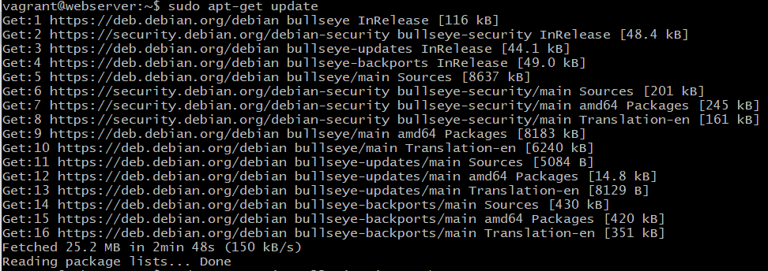
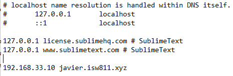
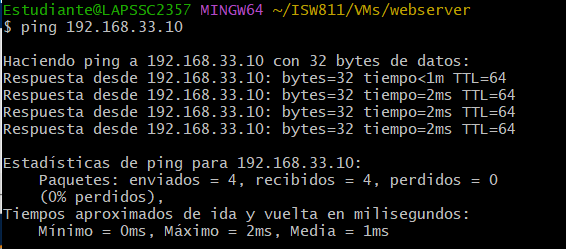
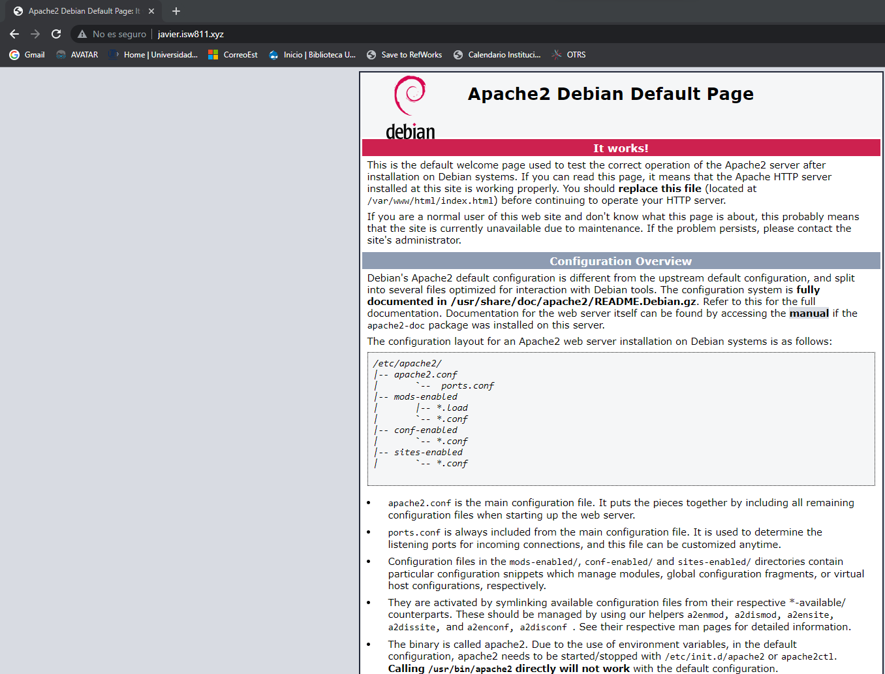
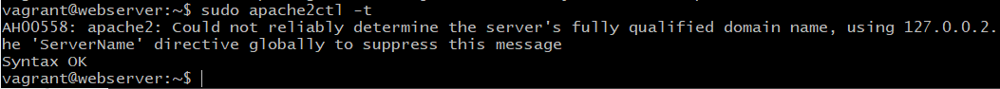

# Workshop 02/LAMP

## Que necesitamos para desplegar una aplicación web?

- Servidor web
- Almacenamiento
- Dominio
- Una IP
- Una App (backend, frontend, fullstack)
- Base de datos
- Presupuesto
- Seguridad
    - Firewall
- SEO
    - Analytics

## Se realizará un servidor con LAMP (Linux, Apache, MySQL y PHP)

### Para iniciar la máquina vagrant en el anfitrión

```bash
cd ISW811/VMs/webserver
vagrant up
```

### Para iniciar la máquina vagrant con ssh

```bash
cd ISW811/VMs/webserver
vagrant ssh
```

### Para cambiar el nombre de host se debe ejecutar este comando, al final va el nombre del server, en este caso es webserver, luego salimos y volvemos a ingresar

```bash
sudo hostnamectl set-hostname webserver
exit
vagrant ssh
```

### Antes de continuar se deben actualizar la lista de paquetes elegibles, con el siguiente comando se descargan los paquetes disponibles. Seguidamente con las últimas 4 líneas se instalan los paquetes necesarios

```bash
sudo apt-get update

sudo apt-get install vim vim-nox \
curl git apache2 mariadb-server mariadb-client \
php7.4 php7.4-bcmath php7.4-curl php7.4-json \
php7.4-mbstring php7.4-mysql php7.4-xml
```


### Ahora se comprobará la dirección de IP desde la máquina anfitriona, se encuentra en el archivo Vagrantfile con el parámetro private_network y se le hace ping

```bash
code Vagrantfile
ping 192.168.33.10
```

### Se modifica el archivo hosts de la máquina anfitriona desde un cmd y utilizando los siguientes comandos.

```bash
cd \
cd Windows\System32\drivers\etc
notepad hosts
```

### dentro del archivo hosts se agrega la línea con la IP y el nombre del dominio, en este caso es 192.168.56.10 javier.isw811.xyz


### Ya guardado se hace ping para verificar que todo funcione y luego se puede acceder a la página desde un navegador ingresando a javier.isw811.xyz

```bash
ping javier.isw811.xyz
```





### Se activan los módulos para habilitar host virtuales y certiificados ssl dentro de la máquina virtual

```bash
sudo a2enmod vhost_alias rewrite ssl
sudo systemctl restart apache2
```

### Se crea una nueva carpeta en la máquina anfitriona para guardar el archivo html que usará nuestro sitio y se agrega el archivo html que podremos modicar a nuestro gusto, en mi caso usaré code para crear el archivo html y modificarlo, dentro de la carpeta sites

```bash
cd ISW811/VMs
mkdir sites
```

### Ahora modificamos con code el archivo Vagranfile y agregamos lo siguiente en la línea 47

```bash
cd cd ISW811/VMs/webserver
code Vagrantfile


47 config.vm.synced_folder "sites/", "/home/vagrant/sites", owner: "www-data", group: "www-data"
```

### Luego se reinicia la máquina vagrant

```bash
exit
vagrant halt
vagant up
vagrant ssh
```

### Para cada sitio que se de desea alojar se debe tener un archivo conf por lo que se va a crear una carpeta donde guardarlo y se procede a crearlo, luego lo abrimos con code y agregamos el texto que se encuentra abajo

```bash
mkdir confs
cd confs
touch javier.isw811.xyz.conf
code javier.isw811.xyz.conf
```

```bash
<VirtualHost *:80>
ServerAdmin webmaster@javier.isw811.xyz
ServerName javier.isw811.xyz
DirectoryIndex index.php index.html
DocumentRoot /home/vagrant/sites/javier.isw811.xyz
<Directory /home/vagrant/sites/javier.isw811.xyz>
DirectoryIndex index.php index.html
AllowOverride All
Require all granted
</Directory>
ErrorLog ${APACHE_LOG_DIR}/javier.isw811.xyz.error.log
LogLevel warn
CustomLog ${APACHE_LOG_DIR}/javier.isw811.xyz.access.log combined
</VirtualHost>
```

### Ahora en la máquina virtual se copia ese archivo conf recién creado y se pegará en la carpeta sites-available

```bash
sudo cp /vagrant/confs/mizaq.isw811.xyz.conf /etc/apache2/sites-available
```

### Ahora se debe reiniciar apache porque se agregó un nuevo archivo conf y tendremos una respuesta "syntax ok"

```bash
sudo apache2ctl -t
```



### Finalmente habilitamos el nuevo sitio, reiniciamos apache y podemos proceder a probarlo ingresando desde el navegador a nuestro sitio y deberíamos ver el html ya aplicado

```bash
sudo apache2ctl -t
sudo a2ensite mizaq.isw811.xyz.conf
sudo systemctl restart apache2.service
```


### Para finalizar se apaga la máquina y se procede a preparar el archivo .tar.gz para entregar