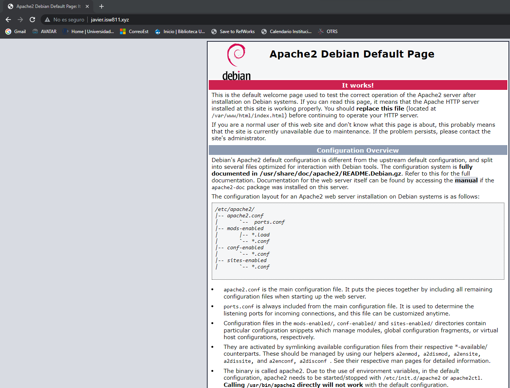

# Workshop 03 - Laravel

## Configuración de Laravel con vagrant

### Se agregarán 3 páginas nuevas deltro del documento hosts usando visual code o cualquier otra herrramienta similar, los nombres de los sitios son los siguientes

´´´bash
touch ltfs.isw811.xyz
touch lospatitos.com
touch elblogdejavier.com
´´´

### Se agregarán 3 archivos conf nuevos para cada una de las páginas creadas

´´´bash
cd confs
touch ltfs.isw811.xyz.conf
touch lospatitos.com.conf
touch elblogdejavier.com.conf
´´´

### Se puede tomar el texto dentro de javier.isw811.xyz.conf y ponerlo dentro de los 3 recién creados pero se debe cambiar los nombres de los dominios, por ejemplo en el dominio lospatitos.com, quedaría de la siguiente forma

´´´bash
    <VirtualHost *:80>
	ServerAdmin webmaster@lospatitos.com
	ServerName lospatitos.com

	# Indexes + Directory Root.
	DirectoryIndex index.php index.html
	DocumentRoot /home/vagrant/sites/lospatitos.com

	<Directory /home/vagrant/sites/lospatitos.com>
		DirectoryIndex index.php index.html
		AllowOverride All
		Require all granted
	</Directory>

	ErrorLog ${APACHE_LOG_DIR}/lospatitos.com.error.log
	LogLevel warn
	CustomLog ${APACHE_LOG_DIR}/lospatitos.com.access.log combined
    </VirtualHost>
´´´

### Se agregan carpetas para los dominios agregados, deben estar dentro de la carpeta sites
´´´bash
mkdir lospatitos.com
mkdir elblogdejavier.com
mkdir ltfs.isw811.xyz

touch lospatitos.com/index.html
touch elblogdejavier.com/index.html
touch ltfs.isw811.xyz/index.html
´´´

### Se modifican los archivos index de cada uno de los dominios que fueron agregados para proceder a activarlos y dbe devolver un mensaje "Syntax ok"

´´´bash
cd /vagrant/confs
sudo cp * /etc/apache2/sites-availible/
sudo a2ensite lospatitos.com.conf
sudo a2ensite elblogdejavier.com.conf
sudo a2ensite lfts.isw811.xyz.conf

sudo apache2ctl -t
sudo systemctl reload apache2
´´´

### Ya funcionando las páginas se procede a instalar composer con el siguiente comando en la máquina virtual.

´´´bash
php -r "copy('https://getcomposer.org/installer', 'composer-setup.php');"
php -r "if (hash_file('sha384', 'composer-setup.php') === '55ce33d7678c5a611085589f1f3ddf8b3c52d662cd01d4ba75c0ee0459970c2200a51f492d557530c71c15d8dba01eae') { echo 'Installer verified'; } else { echo 'Installer corrupt'; unlink('composer-setup.php'); } echo PHP_EOL;"
php composer-setup.php
php -r "unlink('composer-setup.php');"
´´´

### Ya funcionando las páginas se procede a instalar composer con el siguiente comando en la máquina virtual.

´´´bash
sudo mkdir /opt/composer
sudo mv composer.phar /opt/composer
echo $PATH
sudo ln -s /opt/composer/composer.phar /usr/bin/composer
´´´