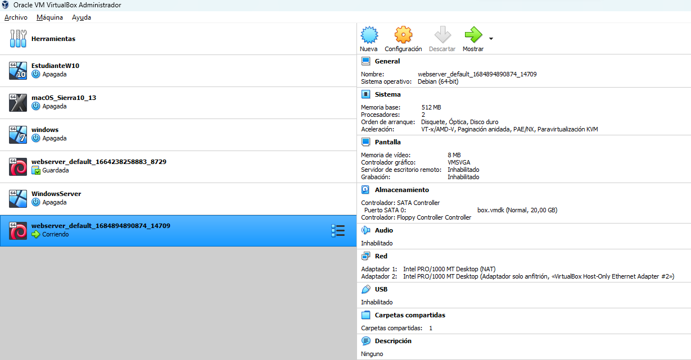
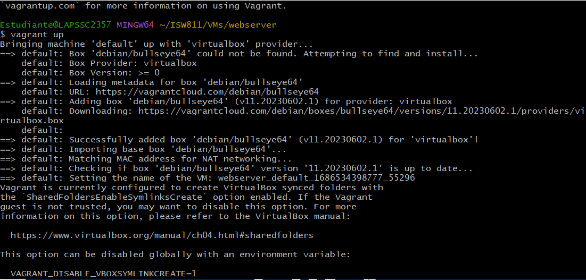
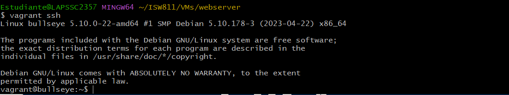
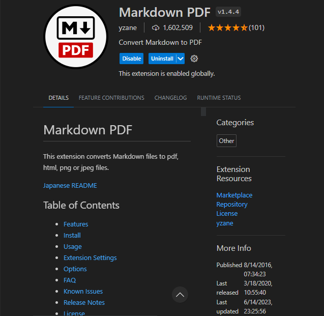

# Workshop 01 - Vagrant

### Instalación de VirtualBox
Se debe descargar el instalador de la página oficial de VirtualBox que corresponda con la máquina huésped. Seguir los pasos del instalador y finalizar.

[VirtualBox](https://www.virtualbox.org/wiki/Downloads "Descargar Virtual-box")



### También se deben descargar e instalar Vagrant y Visual Code desde sus respectivas páginas web oficiales

## Instalación de Vagrant

### Cuando ya se tenga instalado virtualbox, se procede a crear las carpetas para el provisionamiento de la máquina, que será un servidor usando GNU/Linux Bullseye

```bash
mkdir -p ISW811/VMs/webserver
cd ISW811/VMs/webserver
```

### Ahora se inicia Vagrant con los siguientes comandos, esto en primer lugar agrega un archivo Vagrantfile y los siguientes comandos son para coorer la máquina y el último es para apagar la máquina de forma segura

```bash
vagrant init debian/bullseye64
vagrant up
vagrant ssh
vagran halt
```
### vagrant up



### vagrant ssh



### Ahora se debe abrir el archivo Vagrantfile para descomentar la línea 35 y ver la ip que estaremos utilizando, en este caso se editará el archivo utilizando code
```bash
code Vagrantfile
```

### Ahora procederemos a crear un archivo markdown para tener un registro de los pasos que se siguieron en esta sesión, también se estará utilizando una extensión de code que se llama "Markdown pdf" para importar el archivo en formato pdf. Al finalizar de redactar la guía, se crea un documento .tar.gz que será el que se entregará.



```bash
 cd ~
cd ISW811
mkdir Workshops
cd Workshops
mkdir Workshop01
cd Workshop01
touch Readme.md
cd ..
tar cvfz Workshop01-Mizaq.tar.gz Workshop01
```